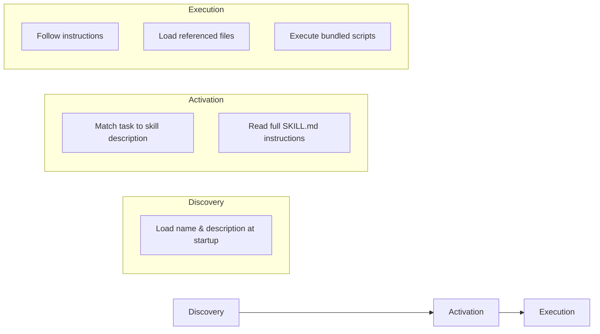
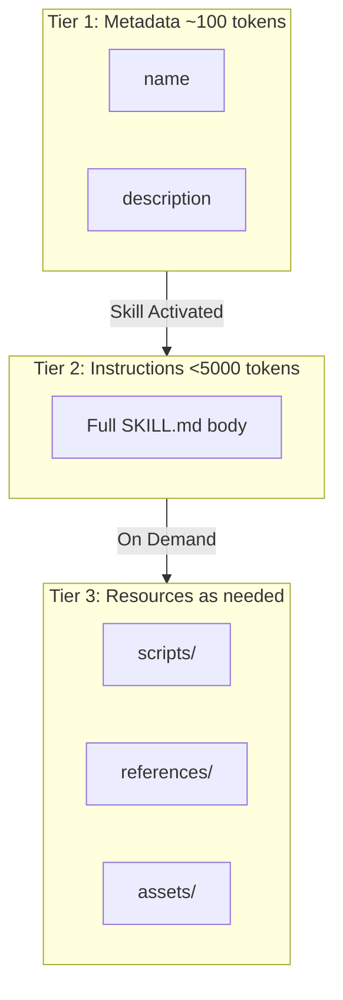

# How to Create an Agent Skill

> A simple, open format for giving agents new capabilities and expertise.

This document contains comprehensive knowledge about creating Agent Skills based on the official [Agent Skills Specification](https://agentskills.io/).

---

## Table of Contents

1. [What are Agent Skills?](#what-are-agent-skills)
2. [Directory Structure](#directory-structure)
3. [SKILL.md Format](#skillmd-format)
4. [Frontmatter Specification](#frontmatter-specification)
5. [Body Content Guidelines](#body-content-guidelines)
6. [Optional Directories](#optional-directories)
7. [Progressive Disclosure](#progressive-disclosure)
8. [Best Practices](#best-practices)
9. [Validation](#validation)
10. [Examples](#examples)

---

## What are Agent Skills?

Agent Skills are a **lightweight, open format** for extending AI agent capabilities with specialized knowledge and workflows. They enable:

| Capability               | Description                                                                                  |
| ------------------------ | -------------------------------------------------------------------------------------------- |
| **Domain Expertise**     | Package specialized knowledge into reusable instructions (legal review, data analysis, etc.) |
| **New Capabilities**     | Give agents new abilities (creating presentations, building MCP servers, analyzing datasets) |
| **Repeatable Workflows** | Turn multi-step tasks into consistent and auditable workflows                                |
| **Interoperability**     | Reuse the same skill across different skills-compatible agent products                       |

### How Skills Work



1. **Discovery**: At startup, agents load only the `name` and `description` of each available skill—just enough to know when it might be relevant.
2. **Activation**: When a task matches a skill's description, the agent reads the full SKILL.md instructions into context.
3. **Execution**: The agent follows the instructions, optionally loading referenced files or executing bundled code as needed.

---

## Directory Structure

A skill is a folder containing at minimum a `SKILL.md` file:

### Minimal Structure

```
skill-name/
└── SKILL.md            # Required: instructions + metadata
```

### Full Structure

```
skill-name/
├── SKILL.md            # Required: instructions + metadata
├── scripts/            # Optional: executable code
├── references/         # Optional: documentation
└── assets/             # Optional: templates, resources
```

> [!IMPORTANT]
> The folder name **must match** the `name` field in the SKILL.md frontmatter.

---

## SKILL.md Format

The SKILL.md file consists of two parts:

1. **Frontmatter** (YAML, required) - Metadata about the skill
2. **Body Content** (Markdown) - Instructions for the agent

### Basic Example

```yaml
---
name: pdf-processing
description: Extract text and tables from PDF files, fill forms, merge documents.
---

# PDF Processing

## When to use this skill

Use this skill when the user needs to work with PDF files...

## How to extract text

1. Use pdfplumber for text extraction...

## How to fill forms

...
```

---

## Frontmatter Specification

The frontmatter uses YAML format between `---` delimiters.

### Required Fields

| Field         | Description                            | Constraints                                  |
| ------------- | -------------------------------------- | -------------------------------------------- |
| `name`        | Short identifier for the skill         | 1-64 chars, lowercase alphanumeric + hyphens |
| `description` | What the skill does and when to use it | 1-1024 characters                            |

### Optional Fields

| Field           | Description                  | Constraints                         |
| --------------- | ---------------------------- | ----------------------------------- |
| `license`       | License applied to the skill | Keep it short                       |
| `compatibility` | Environment requirements     | 1-500 characters                    |
| `metadata`      | Additional custom properties | Map of string key-value pairs       |
| `allowed-tools` | Pre-approved tools to run    | Space-delimited list (experimental) |

### Field Details

#### `name` Field

The skill name must:

- Be **1-64 characters**
- Contain only **lowercase alphanumeric characters and hyphens** (`a-z` and `-`)
- **Not start or end** with `-`
- **Not contain** consecutive hyphens (`--`)
- **Match the parent directory name**

```yaml
# ✅ Good examples
name: pdf-processing
name: data-analysis
name: code-review

# ❌ Bad examples
name: PDF-Processing    # uppercase not allowed
name: -pdf              # cannot start with hyphen
name: pdf--processing   # consecutive hyphens not allowed
```

#### `description` Field

The description must:

- Be **1-1024 characters**
- Describe **what the skill does** AND **when to use it**
- Include **specific keywords** that help agents identify relevant tasks

```yaml
# ✅ Good description
description: Extracts text and tables from PDF files, fills PDF forms, and merges multiple PDFs. Use when working with PDF documents or when the user mentions PDFs, forms, or document extraction.

# ❌ Bad description (too vague)
description: Helps with PDFs.
```

#### `license` Field

Specifies the license applied to the skill:

```yaml
license: Apache-2.0
# or
license: Proprietary. LICENSE.txt has complete terms
```

#### `compatibility` Field

Documents environment requirements:

```yaml
compatibility: Designed for Claude Code (or similar products)
# or
compatibility: Requires git, docker, jq, and access to the internet
```

#### `metadata` Field

Stores additional properties not defined by the spec:

```yaml
metadata:
  author: example-org
  version: "1.0"
```

#### `allowed-tools` Field

> [!WARNING]
> This field is **experimental**. Support may vary between agent implementations.

Pre-approves specific tools to run:

```yaml
allowed-tools: Bash(git:*) Bash(jq:*) Read
```

### Complete Frontmatter Example

```yaml
---
name: pdf-processing
description: Extract text and tables from PDF files, fill forms, merge documents.
license: Apache-2.0
compatibility: Requires Python 3.9+ with pdfplumber installed
metadata:
  author: example-org
  version: "1.0"
allowed-tools: Bash(python:*) Read
---
```

---

## Body Content Guidelines

The body content is standard Markdown and should include:

- **Step-by-step instructions**
- **Examples of inputs and outputs**
- **Common edge cases**
- **When to use the skill**
- **How to accomplish specific tasks**

### Recommended Structure

```markdown
# Skill Name

## When to use this skill

[Describe scenarios and triggers]

## Prerequisites

[List any requirements, dependencies, or setup]

## Instructions

### Task 1: [Primary Task]

1. Step one
2. Step two
3. Step three

### Task 2: [Secondary Task]

...

## Examples

### Example 1: [Scenario]

Input:
[Show expected input]

Output:
[Show expected output]

## Edge Cases

- [Edge case 1 and how to handle it]
- [Edge case 2 and how to handle it]

## Troubleshooting

[Common issues and solutions]
```

---

## Optional Directories

### `scripts/`

Contains executable code that extends the skill's capabilities.

Scripts should:

- Be **self-contained** or clearly document dependencies
- Include **helpful error messages**
- Handle **edge cases gracefully**

Example:

```
scripts/
├── extract.py      # PDF text extraction
├── merge.sh        # PDF merging utility
└── validate.js     # Form validation
```

### `references/`

Contains additional documentation that may be loaded on-demand:

- `REFERENCE.md` - Detailed technical reference
- `FORMS.md` - Form templates or structured data formats
- Domain-specific files (`finance.md`, `legal.md`, etc.)

Example:

```
references/
├── REFERENCE.md    # Detailed API documentation
├── FORMS.md        # Form templates
└── examples.md     # Extended examples
```

### `assets/`

Contains static resources:

- **Templates** - Document templates, configuration templates
- **Images** - Diagrams, examples
- **Data files** - Lookup tables, schemas

Example:

```
assets/
├── templates/
│   ├── invoice.docx
│   └── report.md
├── images/
│   └── workflow.png
└── schemas/
    └── config.json
```

---

## Progressive Disclosure

Skills use a three-tier loading strategy to optimize context usage:

| Level            | Token Budget               | When Loaded                         |
| ---------------- | -------------------------- | ----------------------------------- |
| **Metadata**     | ~100 tokens                | At startup for all skills           |
| **Instructions** | <5000 tokens (recommended) | When skill is activated             |
| **Resources**    | As needed                  | Only when required during execution |



> [!TIP]
> Keep your SKILL.md body content under **5000 tokens** for optimal performance. Use the `references/` directory for detailed documentation that isn't always needed.

### File References

Reference additional files in your SKILL.md using relative paths:

```markdown
See [the reference guide](references/REFERENCE.md) for details.

Run the extraction script: scripts/extract.py
```

The agent will load these files only when it needs them.

---

## Best Practices

### Writing Effective Skills

1. **Be Specific** - Include concrete keywords that help agents identify when to use the skill
2. **Provide Examples** - Show real-world inputs and expected outputs
3. **Handle Edge Cases** - Document common pitfalls and how to avoid them
4. **Keep It Modular** - Break complex skills into focused, composable pieces
5. **Test Thoroughly** - Verify the skill works across different scenarios

### Skill Quality Checklist

- [ ] Name follows naming conventions (lowercase, hyphens, no consecutive hyphens)
- [ ] Description is detailed and includes trigger keywords
- [ ] Instructions are clear and step-by-step
- [ ] Examples demonstrate real usage
- [ ] Edge cases are documented
- [ ] Scripts are self-contained with good error handling
- [ ] Body content is under 5000 tokens

### Security Considerations

When creating skills that include scripts:

- **Sandboxing** - Design scripts to run in isolated environments
- **Allowlisting** - Only include scripts from trusted sources
- **Confirmation** - Document when user confirmation should be requested
- **Logging** - Include logging for audit purposes

---

## Validation

Use the official reference library to validate your skills:

```bash
# Install the skills-ref tool
# (See https://github.com/agentskills/agentskills/tree/main/skills-ref)

# Validate a skill
skills-ref validate ./my-skill

# Generate prompt XML for skills
skills-ref to-prompt ./my-skill
```

The validator checks:

- Valid SKILL.md format
- Correct frontmatter fields
- Name matching directory
- Valid field constraints

---

## Examples

### Example 1: Simple Skill

```
my-simple-skill/
└── SKILL.md
```

**SKILL.md:**

```yaml
---
name: my-simple-skill
description: A simple example skill that demonstrates basic formatting and structure.
---

# My Simple Skill

## When to use this skill

Use this skill when the user asks for a simple demonstration.

## Instructions

1. Greet the user
2. Explain what you're doing
3. Complete the task

## Example

Input: "Show me how this works"
Output: "Here's a demonstration of the simple skill workflow..."
```

### Example 2: Complex Skill with Scripts

```
data-analysis/
├── SKILL.md
├── scripts/
│   ├── analyze.py
│   └── visualize.py
├── references/
│   └── REFERENCE.md
└── assets/
    └── templates/
        └── report.md
```

**SKILL.md:**

```yaml
---
name: data-analysis
description: Analyzes datasets, generates statistical summaries, creates visualizations, and produces formatted reports. Use when working with CSV, JSON, or database exports.
license: MIT
compatibility: Requires Python 3.9+ with pandas, matplotlib
metadata:
  author: data-team
  version: "2.0"
---

# Data Analysis Skill

## When to use this skill

Use this skill when the user needs to:
- Analyze CSV or JSON datasets
- Generate statistical summaries
- Create charts and visualizations
- Produce formatted reports

## Prerequisites

- Python 3.9 or higher
- pandas library
- matplotlib library

## Instructions

### Analyzing Data

1. Load the dataset using `scripts/analyze.py`
2. Review the statistical summary
3. Identify outliers and patterns

### Creating Visualizations

1. Use `scripts/visualize.py` to generate charts
2. Customize based on user preferences
3. Export in requested format

## Examples

See [the reference guide](references/REFERENCE.md) for detailed examples.

## Report Template

Use the template at `assets/templates/report.md` for final output.
```

### Example 3: Minimal Skill (External Source Fetching)

Not all skills need the three-document pattern. Some skills are simple and fetch content from external sources:

```
web-design-guidelines/
└── SKILL.md            # Single file, ~40 lines
```

**SKILL.md:**

```yaml
---
name: web-design-guidelines
description: Review UI code for Web Interface Guidelines compliance. Use when asked to "review my UI", "check accessibility", "audit design", "review UX", or "check my site against best practices".
metadata:
  author: vercel
  version: "1.0.0"
  argument-hint: <file-or-pattern>
---

# Web Interface Guidelines

Review files for compliance with Web Interface Guidelines.

## How It Works

1. Fetch the latest guidelines from the source URL below
2. Read the specified files (or prompt user for files/pattern)
3. Check against all rules in the fetched guidelines
4. Output findings in the terse `file:line` format

## Guidelines Source

Fetch fresh guidelines before each review:

```

https://raw.githubusercontent.com/vercel-labs/web-interface-guidelines/main/command.md

```

Use WebFetch to retrieve the latest rules. The fetched content contains all the rules and output format instructions.

## Usage

When a user provides a file or pattern argument:
1. Fetch guidelines from the source URL above
2. Read the specified files
3. Apply all rules from the fetched guidelines
4. Output findings using the format specified in the guidelines

If no files specified, ask the user which files to review.
```

**When to use minimal skills:**

- Content comes from an external, maintained source
- Rules update frequently and shouldn't be cached locally
- The skill is a thin wrapper around external tooling
- Simple workflows that don't need extensive documentation

### Example 4: Real-world Skill (Rust System Engineering)

See the existing skill at `.agent/skills/rust-system-engineering/SKILL.md` for a complete real-world example of domain expertise packaging.

---

## Resources

- [Official Agent Skills Specification](https://agentskills.io/specification)
- [What are Skills?](https://agentskills.io/what-are-skills)
- [Integrate Skills into Your Agent](https://agentskills.io/integrate-skills)
- [Example Skills on GitHub](https://github.com/anthropics/skills)
- [Reference Library (skills-ref)](https://github.com/agentskills/agentskills/tree/main/skills-ref)
- [Authoring Best Practices](https://platform.claude.com/docs/en/agents-and-tools/agent-skills/best-practices)

---

## Quick Reference Card

```
┌─────────────────────────────────────────────────────────────┐
│                    AGENT SKILL STRUCTURE                     │
├─────────────────────────────────────────────────────────────┤
│                                                              │
│  skill-name/                                                 │
│  ├── SKILL.md          # Required: instructions + metadata   │
│  ├── scripts/          # Optional: executable code          │
│  ├── references/       # Optional: documentation            │
│  └── assets/           # Optional: templates, resources     │
│                                                              │
├─────────────────────────────────────────────────────────────┤
│                    SKILL.MD FORMAT                           │
├─────────────────────────────────────────────────────────────┤
│                                                              │
│  ---                                                         │
│  name: skill-name                    # Required, 1-64 chars  │
│  description: What and when...       # Required, 1-1024 chars│
│  license: MIT                        # Optional              │
│  compatibility: Requires X           # Optional, 1-500 chars │
│  metadata:                           # Optional              │
│    author: me                                                │
│    version: "1.0"                                            │
│  allowed-tools: Bash(git:*) Read     # Optional, experimental│
│  ---                                                         │
│                                                              │
│  # Instructions in Markdown                                  │
│                                                              │
│  ## When to use this skill                                   │
│  ## Step-by-step instructions                                │
│  ## Examples                                                 │
│  ## Edge cases                                               │
│                                                              │
├─────────────────────────────────────────────────────────────┤
│                    NAME RULES                                │
├─────────────────────────────────────────────────────────────┤
│                                                              │
│  ✅ lowercase-with-hyphens                                   │
│  ✅ Must match folder name                                   │
│  ❌ No UPPERCASE                                             │
│  ❌ No --consecutive-- hyphens                               │
│  ❌ No -leading or trailing-                                 │
│                                                              │
├─────────────────────────────────────────────────────────────┤
│                    TOKEN BUDGETS                             │
├─────────────────────────────────────────────────────────────┤
│                                                              │
│  Metadata (name + description):  ~100 tokens                 │
│  Instructions (SKILL.md body):   <5000 tokens recommended    │
│  Resources (scripts, refs):      loaded on demand            │
│                                                              │
└─────────────────────────────────────────────────────────────┘
```

---

## Production-Grade Skill Writing

This section provides advanced patterns for writing production-grade skills, based on analysis of real-world examples like the `vercel-react-best-practices` skill.

### Anatomy of a Production-Grade Skill

A production-grade skill typically has this structure:

```
my-production-skill/
├── SKILL.md                 # Main entry point (~5000 tokens)
├── AGENTS.md                # Full compiled document (unlimited)
└── rules/                   # Individual rule files
    ├── category-rule-1.md
    ├── category-rule-2.md
    └── ...
```

### The Three-Document Pattern

Production skills often use three levels of documentation:

| Document        | Purpose                    | Token Budget   | When Loaded               |
| --------------- | -------------------------- | -------------- | ------------------------- |
| **SKILL.md**    | Quick reference + metadata | <5000 tokens   | On skill activation       |
| **AGENTS.md**   | Complete compiled guide    | Unlimited      | On demand (for AI agents) |
| **rules/\*.md** | Individual detailed rules  | ~500-2000 each | On demand                 |

#### 1. SKILL.md - The Entry Point

Keep it concise with:

- Clear description with trigger keywords
- Quick reference table of categories
- List of all rules with one-line descriptions
- Links to detailed documentation

**Example structure:**

```yaml
---
name: my-best-practices
description: [Detailed description with keywords]. Triggers on tasks involving [specific triggers].
license: MIT
metadata:
  author: your-org
  version: "1.0.0"
---

# Skill Name

Brief introduction (1-2 sentences).

## When to Apply

Reference these guidelines when:
- [Scenario 1]
- [Scenario 2]

## Rule Categories by Priority

| Priority | Category | Impact | Prefix |
|----------|----------|--------|--------|
| 1 | [Category Name] | CRITICAL | `prefix-` |
| 2 | [Category Name] | HIGH | `prefix-` |

## Quick Reference

### 1. [Category Name] (CRITICAL)

- `prefix-rule-1` - One-line description
- `prefix-rule-2` - One-line description

## How to Use

Read individual rule files for detailed explanations:

```

rules/prefix-rule-1.md
rules/prefix-rule-2.md

```

## Full Compiled Document

For the complete guide with all rules expanded: `AGENTS.md`
```

#### 2. AGENTS.md - The Full Document

This is designed for AI agents that need comprehensive information:

- Full explanations with code examples
- Incorrect vs Correct patterns (and multiple Correct alternatives)
- Contextual notes for conditional applicability
- Lint rule references when available
- References and links
- No token limit concerns

**Required sections:**

1. **Header** - Title, version, author, date
2. **Note block** - Clarify this is for AI agents/LLMs
3. **Abstract** - Summary with rule counts, category overview, and what makes this skill distinct
4. **Table of Contents** - Nested structure with impact levels
5. **Categories** - Each with impact header and rules
6. **References** - Numbered list of authoritative sources

**Complete AGENTS.md Header Template:**

```markdown
# Skill Name Best Practices

**Version 1.0.0**  
Your Organization  
Month Year

> **Note:**  
> This document is mainly for agents and LLMs to follow when maintaining,  
> generating, or refactoring code. Humans may also find it useful, but guidance  
> here is optimized for automation and consistency by AI-assisted workflows.

---

## Abstract

Comprehensive [domain] optimization guide for [technology] applications, designed
for AI agents and LLMs. Contains [N]+ rules across [M] categories, prioritized by
impact from critical ([top categories]) to incremental ([lower categories]). Each
rule includes detailed explanations, real-world examples comparing incorrect vs.
correct implementations, and specific impact metrics to guide automated refactoring
and code generation.

---

## Table of Contents

1. [Category Name](#1-category-name) — **CRITICAL**
   - 1.1 [Rule Title](#11-rule-title)
   - 1.2 [Another Rule](#12-another-rule)
2. [Second Category](#2-second-category) — **HIGH**
   - 2.1 [Rule Title](#21-rule-title)
     ...

---
```

> [!IMPORTANT]
> The Note block is essential—it sets expectations that the document is optimized for AI consumption, not just human reading.

**ToC Anchor Generation Rules:**

When creating Table of Contents anchors:

- Convert to lowercase
- Replace spaces with hyphens
- Remove special characters (parentheses, ampersands, etc.)
- For `&&`, remove entirely (e.g., "Never Use && with Values" → `#11-never-use--with-values`)
- Preserve numbers with their position

**Example anchors:**

| Title                                            | Anchor                                         |
| ------------------------------------------------ | ---------------------------------------------- |
| `1. Core Rendering`                              | `#1-core-rendering`                            |
| `1.1 Never Use && with Potentially Falsy Values` | `#11-never-use--with-potentially-falsy-values` |
| `2.1 Avoid Inline Objects in renderItem`         | `#21-avoid-inline-objects-in-renderitem`       |

**Example Abstract (include what makes the skill distinct):**

```markdown
## Abstract

Composition patterns for building flexible, maintainable React components. Avoid
boolean prop proliferation by using compound components, lifting state, and
composing internals. These patterns make codebases easier for both humans and AI
agents to work with as they scale.

Contains 7 rules across 3 categories, prioritized by impact from HIGH (Component
Architecture) to MEDIUM (State Management, Implementation Patterns). Each rule
includes detailed explanations, real-world examples comparing incorrect vs.
correct implementations, and specific impact metrics.

---
```

> [!TIP]
> The abstract should mention: (1) what problem the skill solves, (2) rule/category counts, (3) what makes this skill's approach distinct.

**Example Table of Contents:**

```markdown
## Table of Contents

1. [Component Architecture](#1-component-architecture) — **HIGH**
   - 1.1 [Avoid Boolean Prop Proliferation](#11-avoid-boolean-prop-proliferation)
   - 1.2 [Use Compound Components](#12-use-compound-components)
2. [State Management](#2-state-management) — **MEDIUM**
   - 2.1 [Decouple State Management from UI](#21-decouple-state-management-from-ui)
   - 2.2 [Define Generic Context Interfaces](#22-define-generic-context-interfaces)
```

#### Category Structure in AGENTS.md

Each category section should start with an impact header and brief description:

```markdown
## 1. Component Architecture

**Impact: HIGH**

Fundamental patterns for structuring components to avoid prop
proliferation and enable flexible composition.

### 1.1 Avoid Boolean Prop Proliferation

**Impact: CRITICAL (prevents unmaintainable component variants)**

Don't add boolean props like `isThread`, `isEditing`, `isDMThread` to customize
component behavior. Each boolean doubles possible states and creates
unmaintainable conditional logic. Use composition instead.

**Incorrect (boolean props create exponential complexity):**

[code example...]

**Correct (composition eliminates conditionals):**

[code example...]
```

This structure helps agents:

- Quickly assess category priority via the header
- Understand rule impact with parenthetical explanation
- See labeled Incorrect/Correct patterns

#### 3. Individual Rule Files

Each rule file should be self-contained with frontmatter and a body that repeats the title:

**Complete Rule File Template:**

````yaml
---
title: Use a List Virtualizer for Any List
impact: HIGH
impactDescription: reduced memory, faster mounts
tags: lists, performance, virtualization, scrollview
---

## Use a List Virtualizer for Any List

Use a list virtualizer like LegendList or FlashList instead of ScrollView with
mapped children—even for short lists. Virtualizers only render visible items,
reducing memory usage and mount time. ScrollView renders all children upfront,
which gets expensive quickly.

**Incorrect (ScrollView renders all items at once):**

```tsx
function Feed({ items }: { items: Item[] }) {
  return (
    <ScrollView>
      {items.map((item) => (
        <ItemCard key={item.id} item={item} />
      ))}
    </ScrollView>
  )
}
// 50 items = 50 components mounted, even if only 10 visible
````

**Correct (virtualizer renders only visible items):**

```tsx
import { LegendList } from "@legendapp/list";

function Feed({ items }: { items: Item[] }) {
  return (
    <LegendList
      data={items}
      // if you aren't using React Compiler, wrap these with useCallback
      renderItem={({ item }) => <ItemCard item={item} />}
      keyExtractor={(item) => item.id}
      estimatedItemSize={80}
    />
  );
}
// Only ~10-15 visible items mounted at a time
```

**Alternative (FlashList):**

```tsx
import { FlashList } from "@shopify/flash-list";

function Feed({ items }: { items: Item[] }) {
  return (
    <FlashList
      data={items}
      renderItem={({ item }) => <ItemCard item={item} />}
      keyExtractor={(item) => item.id}
    />
  );
}
```

Benefits apply to any screen with scrollable content—profiles, settings, feeds,
search results. Default to virtualization.

````

> [!IMPORTANT]
> **Key formatting rules for rule files:**
> - The `## Title` header in the body should **repeat the frontmatter title exactly**
> - Labels use format: `**Incorrect (reason):**` with the reason in parentheses
> - Comments after code blocks explain behavior (e.g., `// 50 items = 50 components mounted`)

> [!TIP]
> The `impactDescription` should be a **concise action phrase** describing the benefit:
> - ✅ `reduced memory, faster mounts` (quantifiable benefits)
> - ✅ `prevents unmaintainable component variants` (describes the problem it solves)
> - ✅ `enables flexible composition without prop drilling` (describes the benefit)
> - ❌ `improves performance` (too vague—doesn't explain how)
> - ❌ `HIGH` (just restating the impact level)

**Lint Rule Reference Format:**

When a rule can be enforced by linting, include a specific reference:

```markdown
**Lint rule:** Enable `react/jsx-no-leaked-render` from
[eslint-plugin-react](https://github.com/jsx-eslint/eslint-plugin-react/blob/master/docs/rules/jsx-no-leaked-render.md)
to catch this automatically.
````

**Note format for conditional rules:**

```markdown
**Note:** If you have the React Compiler enabled, it handles memoization
automatically and these manual optimizations become less critical.
```

### Multiple Correct Solutions Pattern

When multiple valid solutions exist, present them with clear labels:

```markdown
**Correct: ternary with null**
[code example]

**Correct: explicit boolean coercion**
[code example]

**Alternative: FlashList**
[code example]

**Best: early return**
[code example]
```

This gives agents flexibility while indicating preference order.

**Alternative Pattern with Full Explanation:**

Use `**Alternative:**` or `**Alternative (context):**` for secondary solutions that may be preferred in specific situations:

````markdown
**Alternative: without extra dependencies**

```typescript
const userPromise = fetchUser();
const profilePromise = userPromise.then((user) => fetchProfile(user.id));

const [user, config, profile] = await Promise.all([
  userPromise,
  fetchConfig(),
  profilePromise,
]);
```

We can also create all the promises first, and do `Promise.all()` at the end.
````

Alternatives should include:

- A clear label indicating what makes this approach different
- Complete, runnable code (not just a fragment)
- A brief note explaining when this alternative might be preferred

### Contextual Notes Pattern

Include notes when rules have conditional applicability:

```markdown
**Note:** If you have the React Compiler enabled, it handles memoization
automatically and these manual optimizations become less critical.
```

Other common contexts:

- Framework-specific variations (Next.js, Expo, etc.)
- Version-specific behavior
- Performance trade-offs

### When NOT to Use Pattern

For nuanced rules, include explicit counter-examples to help agents understand boundaries:

```markdown
**When NOT to use this pattern:**

- Critical data needed for layout decisions (affects positioning)
- SEO-critical content above the fold
- Small, fast queries where suspense overhead isn't worth it
- When you want to avoid layout shift (loading → content jump)

**Trade-off:** Faster initial paint vs potential layout shift. Choose based on your UX priorities.
```

This pattern is especially valuable for:

- Performance optimizations with trade-offs
- Patterns that add complexity (worth it only in certain cases)
- Rules that might conflict with other best practices
- Architectural decisions with multiple valid approaches

### Lint Rule References

When a rule can be enforced by tooling, include actionable configuration:

```markdown
**Lint rule:** Enable `react/jsx-no-leaked-render` from
[eslint-plugin-react](https://github.com/jsx-eslint/eslint-plugin-react) to catch this automatically.
```

**Additional context or references**

```

### Priority and Impact Classification

Use consistent impact levels across all rules:

| Level | When to Use | Examples |
|-------|-------------|----------|
| **CRITICAL** | Directly affects user experience or security | Performance killers, security vulnerabilities |
| **HIGH** | Significant optimization opportunities | Server-side improvements, caching |
| **MEDIUM-HIGH** | Noticeable improvements | Client-side optimizations |
| **MEDIUM** | Incremental improvements | Re-render optimizations |
| **LOW-MEDIUM** | Minor improvements | JavaScript micro-optimizations |
| **LOW** | Edge case improvements | Advanced patterns |

### Naming Conventions for Rules

Use consistent prefixes to group related rules:

```

category-specific-rule.md

`````

**Examples by domain:**

| Domain | Prefix | Examples |
|--------|--------|----------|
| Component Architecture | `architecture-` | `architecture-avoid-boolean-props.md`, `architecture-compound-components.md` |
| State Management | `state-` | `state-lift-state.md`, `state-context-interface.md`, `state-decouple-implementation.md` |
| Implementation Patterns | `patterns-` | `patterns-explicit-variants.md`, `patterns-children-over-render-props.md` |
| Async Operations | `async-` | `async-parallel.md`, `async-defer-await.md` |
| Bundle Optimization | `bundle-` | `bundle-barrel-imports.md`, `bundle-dynamic-imports.md` |
| Server-side | `server-` | `server-cache-react.md`, `server-streaming.md` |
| Client-side | `client-` | `client-swr-dedup.md`, `client-suspense.md` |
| Re-renders | `rerender-` | `rerender-memo.md`, `rerender-stable-refs.md` |

> [!TIP]
> The prefix should match category names for easy grouping and discovery.


### Code Example Patterns

Always show **incorrect** and **correct** patterns:

````markdown
**Incorrect: [reason why it's wrong]**

```typescript
// Code that demonstrates the problem
// Add comments explaining what's happening
`````

`````

**Correct: [what makes it right]**

```typescript
// Code that demonstrates the solution
// Add comments explaining the improvement
```

````

Include quantifiable impact when possible:
- "2-10× improvement"
- "200-800ms import cost reduction"
- "~40% faster cold starts"

### Comment-as-Documentation Pattern

Add inline comments after code blocks to quantify impact. This helps agents understand the real-world difference between approaches:

````markdown
**Incorrect: imports entire library**

```tsx
import { Check, X, Menu } from 'lucide-react'
// Loads 1,583 modules, takes ~2.8s extra in dev
// Runtime cost: 200-800ms on every cold start
```

**Correct: imports only what you need**

```tsx
import Check from 'lucide-react/dist/esm/icons/check'
// Loads only 3 modules (~2KB vs ~1MB)
```
````

**Effective comment patterns:**

| Pattern | Example |
|---------|--------|
| **Quantified counts** | `// 50 items = 50 components mounted, even if only 10 visible` |
| **Comparison** | `// ~2KB vs ~1MB` |
| **Time impact** | `// takes ~2.8s extra in dev` |
| **Behavior explanation** | `// Only ~10-15 visible items mounted at a time` |
| **What happens** | `// Returns immediately without waiting` |

These comments serve as documentation that agents can parse to understand trade-offs and make informed decisions.

### Frontmatter Best Practices

**For SKILL.md:**

```yaml
---
name: skill-name
description: [50-200 words]. What it does. When to use it. Trigger keywords.
license: MIT
metadata:
  author: organization-name
  version: "1.0.0"
---
````

**For individual rules:**

```yaml
---
title: Human-Readable Rule Title
impact: CRITICAL | HIGH | MEDIUM | LOW
impactDescription: Brief quantifiable benefit
tags: comma, separated, keywords
---
```

### Reference Links

Include authoritative references at the end of individual rules:

```markdown
Reference: [https://official-docs.com/relevant-page](https://official-docs.com/relevant-page)
```

Or with descriptive text:

```markdown
Reference: [How we optimized X in product](https://blog.example.com/optimization-post)
```

### Inline References Per Rule

For production-grade skills, include inline references **directly after each relevant rule**, not just at the end. This helps agents find authoritative sources immediately:

````markdown
### 2.1 Avoid Barrel File Imports

**Impact: CRITICAL (200-800ms import cost, slow builds)**

Import directly from source files instead of barrel files...

[code examples...]

Direct imports provide 15-70% faster dev boot, 28% faster builds, 40% faster cold starts.

Libraries commonly affected: `lucide-react`, `@mui/material`, `lodash`, `date-fns`.

Reference: [https://vercel.com/blog/how-we-optimized-package-imports-in-next-js](https://vercel.com/blog/how-we-optimized-package-imports-in-next-js)
````

**Benefits of inline references:**
- Agents can verify claims immediately
- Provides context for when external docs might have more detail
- Establishes credibility of specific recommendations
- Helps with rule maintenance (easier to check if sources are still valid)

**For AGENTS.md, include BOTH inline references AND a numbered references section at the end:**

```markdown
---

## References

1. [https://react.dev](https://react.dev)
2. [https://react.dev/learn/passing-data-deeply-with-context](https://react.dev/learn/passing-data-deeply-with-context)
3. [https://react.dev/reference/react/use](https://react.dev/reference/react/use)
```

The end-of-document references section provides a central location for all authoritative sources, while inline references provide immediate context where needed.

### Table of Contents for Large Documents

For AGENTS.md, use nested TOC structure with the `—` separator before impact level:

```markdown
## Table of Contents

1. [Category 1](#1-category-1) — **CRITICAL**
   - 1.1 [Rule 1](#11-rule-1)
   - 1.2 [Rule 2](#12-rule-2)
2. [Category 2](#2-category-2) — **HIGH**
   - 2.1 [Rule 3](#21-rule-3)
```

### Category Aggregation: SKILL.md vs AGENTS.md

SKILL.md and AGENTS.md may have different category structures. This is intentional:

| Document | Purpose | Category Approach |
|----------|---------|-------------------|
| **SKILL.md** | Quick reference | Aggregate into 5-8 high-level categories |
| **AGENTS.md** | Complete guide | Show all 10-15 granular categories |

**Example from `vercel-react-native-skills`:**

**SKILL.md (7 aggregated categories):**
```markdown
| Priority | Category         | Impact   | Prefix               |
| -------- | ---------------- | -------- | -------------------- |
| 1        | List Performance | CRITICAL | `list-performance-`  |
| 2        | Animation        | HIGH     | `animation-`         |
| 3        | UI Patterns      | HIGH     | `ui-`                |
| 4        | State Management | MEDIUM   | `react-state-`       |
| 5        | Rendering        | MEDIUM   | `rendering-`         |
| 6        | Monorepo         | MEDIUM   | `monorepo-`          |
| 7        | Configuration    | LOW      | `fonts-`, `imports-` |
```

**AGENTS.md (13 granular categories):**
```markdown
1. [Core Rendering](#1-core-rendering) — **CRITICAL**
2. [List Performance](#2-list-performance) — **HIGH**
3. [Animation](#3-animation) — **HIGH**
4. [Scroll Performance](#4-scroll-performance) — **HIGH**
5. [React State](#5-react-state) — **MEDIUM**
6. [State Architecture](#6-state-architecture) — **MEDIUM**
7. [React Compiler](#7-react-compiler) — **MEDIUM**
8. [User Interface](#8-user-interface) — **MEDIUM**
9. [Design System](#9-design-system) — **MEDIUM**
10. [Monorepo](#10-monorepo) — **LOW**
11. [Third-Party Dependencies](#11-third-party-dependencies) — **LOW**
12. [JavaScript](#12-javascript) — **LOW**
13. [Fonts](#13-fonts) — **LOW**
```

**Why different?**
- SKILL.md is optimized for quick scanning (~100 tokens)
- AGENTS.md provides complete context for thorough work
- Aggregation helps agents quickly identify relevant sections

### Rule Count Guidelines

A production skill can range from focused (7 rules) to comprehensive (60+ rules):

| Skill Size        | Categories | Rules per Category | Total Rules | Use Case                        |
| ----------------- | ---------- | ------------------ | ----------- | ------------------------------- |
| **Focused**       | 3-4        | 2-3                | 7-15        | Specific patterns or techniques |
| **Standard**      | 5-8        | 3-5                | 20-40       | Domain best practices           |
| **Comprehensive** | 8-13       | 3-7                | 40-60       | Full optimization guides        |

| Metric          | Recommended Range |
| --------------- | ----------------- |
| SKILL.md tokens | <5000             |
| SKILL.md lines  | 80-150            |
| AGENTS.md lines | 500-3000          |

**Example: Focused Skill (vercel-composition-patterns)**

- 3 categories (Component Architecture, State Management, Implementation Patterns)
- 7 total rules
- Categories range from 2-3 rules each
- SKILL.md: 82 lines (~2.5KB)
- AGENTS.md: 900 lines (~21KB)

**Example: Comprehensive Skill (vercel-react-native-skills)**

- 13 categories (Core Rendering, List Performance, Animation, etc.)
- 35 total rules
- Categories range from 1-7 rules each
- SKILL.md: 116 lines (~4KB)
- AGENTS.md: 2586 lines (~66KB)

> [!NOTE]
> Production-grade doesn't mean "more rules." A focused skill with 7 well-documented rules is equally valuable as a comprehensive skill with 50+ rules. Choose scope based on the domain's complexity.

### Production Skill Checklist

- [ ] **Structure**
  - [ ] SKILL.md under 5000 tokens
  - [ ] AGENTS.md with complete documentation
  - [ ] AGENTS.md includes Abstract section with rule/category counts
  - [ ] Individual rule files in `rules/` directory
  - [ ] 3-8 categories with 2-10 rules each

- [ ] **Metadata**
  - [ ] Clear, keyword-rich description with trigger keywords
  - [ ] Version number in metadata (semantic versioning)
  - [ ] Author/organization attribution
  - [ ] License specified

- [ ] **Content Quality**
  - [ ] All rules have impact classification (CRITICAL/HIGH/MEDIUM/LOW)
  - [ ] All rules have concise `impactDescription` (action phrase, not just metrics)
  - [ ] Incorrect/Correct code examples for each rule
  - [ ] Multiple correct solutions with labels when applicable
  - [ ] Contextual notes for conditional applicability (e.g., React Compiler)
  - [ ] Lint rule references when enforceable by tooling
  - [ ] Reference links to authoritative sources

- [ ] **Organization**
  - [ ] Rules grouped by category with consistent prefixes
  - [ ] Categories have impact header in AGENTS.md (e.g., **Impact: HIGH**)
  - [ ] Categories prioritized by impact (CRITICAL → LOW)
  - [ ] Quick reference table in SKILL.md
  - [ ] Full nested TOC in AGENTS.md with impact indicators

### Real-World Example: Focused Skill (vercel-composition-patterns)

This skill demonstrates a focused, production-grade skill:

```
vercel-composition-patterns/
├── SKILL.md           # 82 lines, ~2.5KB - Quick reference
├── AGENTS.md          # 900 lines, ~21KB - Full compiled guide
└── rules/             # 7 individual rule files
    ├── architecture-avoid-boolean-props.md
    ├── architecture-compound-components.md
    ├── state-context-interface.md
    ├── state-decouple-implementation.md
    ├── state-lift-state.md
    ├── patterns-explicit-variants.md
    └── patterns-children-over-render-props.md
```

**Key characteristics:**

- 3 categories organized by priority (HIGH → MEDIUM)
- 7 individual rules with consistent structure
- Each rule has: title, impact, impactDescription (action phrase), tags
- Clear Incorrect/Correct code examples with explanatory labels
- Note block at top of AGENTS.md for AI agents
- References section at end of AGENTS.md
- Focused scope makes it easy to maintain and update

---

### Real-World Example: Comprehensive Skill (vercel-react-best-practices)

This skill demonstrates a comprehensive, production-grade skill:

```
vercel-react-best-practices/
├── SKILL.md           # 137 lines, ~6KB - Quick reference
├── AGENTS.md          # 2935 lines, ~82KB - Full compiled guide
└── rules/             # 57 individual rule files
    ├── async-parallel.md
    ├── bundle-barrel-imports.md
    ├── server-cache-react.md
    └── ... (57 total)
```

**Key characteristics:**

- 8 categories organized by priority (CRITICAL → LOW)
- 57 individual rules with consistent structure
- Each rule has: title, impact, impactDescription, tags, incorrect/correct examples
- Multiple correct solutions with labels when applicable
- Contextual notes for conditional applicability
- Lint rule references when enforceable by tooling
- References to official documentation
- Designed for both human and AI consumption

---

_Document created based on the [Agent Skills Specification](https://agentskills.io/) by Anthropic._
`````
