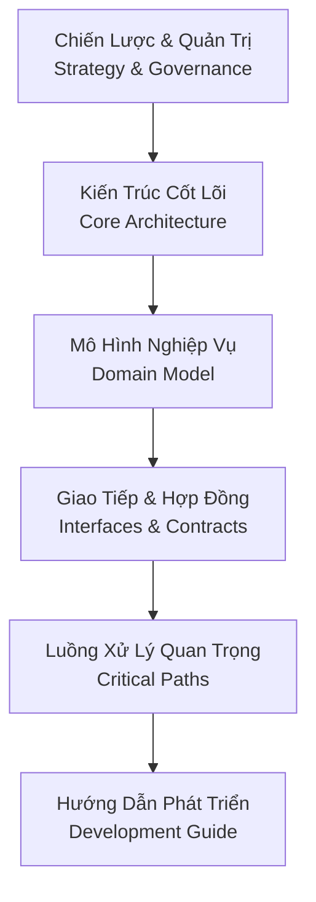

# Agent Skills Factory 🏭

Welcome to the Agent Skills Factory. This workspace is designed to help you create, refine, and manage high-quality Agent Skills by following best practices and learning from existing codebases.

## Directory Structure

| Directory                  | Purpose                                                                                                                               |
| :------------------------- | :------------------------------------------------------------------------------------------------------------------------------------ |
| [`ref/`](ref/)             | **Reference Repositories.** Clone external projects here to analyze their coding patterns, design choices, and architecture.          |
| [`library/`](library/)     | **Documentation & APIs.** Store raw documentation, API specifications, or library source code here for extracting skill instructions. |
| [`templates/`](templates/) | **Blueprints.** Contains boilerplate files and structures for new skills to ensure consistency.                                       |
| [`scripts/`](scripts/)     | **Automation.** Helper scripts for scaffolding new skills, validating formatting, or compiling documents.                             |
| [`work/`](work/)           | **Active Projects.** Useful for placing symbolic links to skills currently under development in `.agent/skills/`.                     |

## Key Resources

- [**CREATE-AGENT-SKILL.md**](CREATE-AGENT-SKILL.md): The master guide for creating Agent Skills, including the "Three-Document Pattern" for production-grade skills.

## Workflow

1. **Research**: Clone a repo into `ref/` and analyze how it solves specific problems.
2. **Extract**: Gather API details or documentation into `library/`.
3. **Draft**: Use the guides in `CREATE-AGENT-SKILL.md` and templates in `templates/` to start your skill.
4. **Develop**: Build the skill (suggested location: `.agent/skills/`) and link it to `work/` for easy access within this factory.
5. **Verify**: Use scripts or manual audits to ensure the skill meets production standards.

## Architecture Extraction & Analysis

Chúng ta sẽ rà soát tất cả các codebase (plain text code) đã được trích xuất bởi `repomix` để phù hợp cho việc đọc hàng trăm ngàn tokens. Từ mỗi lần đọc codebase sẽ trích xuất ra **THÔNG TIN VỀ KIẾN TRÚC HỆ THỐNG** và sẽ được sử dụng để viết các Agent Skill.

Những **THÔNG TIN KIẾN TRÚC HỆ THỐNG BAO GỒM**:

### **7.1. Tháp Thông Tin 5+1 (5+1 Information Tower)**

Thay vì quản lý theo thư mục vật lý, chúng ta tư duy theo **Tháp Thông Tin**. Các LLM sẽ quét toàn bộ codebase và sắp xếp tri thức vào các tầng này để phục vụ `Agent Skills`.

| Tầng Thông Tin             | Mục đích Chính                                                        | Đối tượng Chính      | Định dạng Output   |
| :------------------------- | :-------------------------------------------------------------------- | :------------------- | :----------------- |
| **Strategy & Governance**  | Báo cáo sức khỏe dự án, rủi ro, và roadmap.                           | PM, EM, CTO          | Text/Slide         |
| **Core Architecture**      | **(Quan trọng nhất)** Quyết định thiết kế, sơ đồ hệ thống, nguyên lý. | Architect, Tech Lead | C4 Diagrams, ADRs  |
| **Domain Model**           | Thực thể (Entities), luồng dữ liệu, Business Logic.                   | Developer, BA        | Class Diagram, ERD |
| **Interfaces & Contracts** | Public API, RPC, Module Contracts.                                    | Developer, QA        | OpenAPI, Proto     |
| **Critical Paths**         | Luồng xử lý quan trọng, hiệu năng cao, xử lý lỗi.                     | Senior Dev, SRE      | Sequence Diagram   |
| **Development Guide**      | Hướng dẫn nhập môn, quy chuẩn, debug.                                 | New Hire             | Markdown           |

### **7.2. Chi Tiết Các Tầng Thông Tin**

Dưới đây là đặc tả chi tiết các nội dung cần trích xuất cho từng tầng, đảm bảo tính đầy đủ và hữu dụng cho Agent.

#### **Tầng 1: Core Architecture (Nền Tảng)**

Đây là tầng quan trọng nhất, đóng vai trò là "bản thiết kế" của hệ thống. Nó giải thích "tại sao" hệ thống được xây dựng như vậy.

- **Context & Containers**:
  - **C4 Context Diagram**: Sơ đồ bao quát hiển thị hệ thống trong bối cảnh môi trường CNTT.
  - **Deployment Units**: Danh sách các binaries, containers, services độc lập.
- **Components & Patterns**:
  - **Module Breakdown**: Phân rã chi tiết cấu trúc Crate/Module.
  - **Design Patterns**: Các mẫu thiết kế đặc thù (e.g., Type-State, Actor, Builder).
- **Decisions (ADRs)**:
  - Các quyết định kiến trúc quan trọng: Bối cảnh (Context), Lựa chọn (Decision), Hệ quả (Consequences).
- **System Qualities**:
  - Concurrency model, Memory safety, Error handling strategy, Security.

#### **Tầng 0: Strategy & Governance (Chiến Lược)**

- **Project Health**: Tổng quan về sức khỏe dự án (Code metrics, coverage, build time).
- **Risk Radar**: Đánh giá nợ kỹ thuật (Technical Debt), các dependencies lỗi thời, và rủi ro bảo trì.

#### **Tầng 2: Domain Model (Nghiệp Vụ)**

- **Core Entities**: Danh sách và mô tả các Struct/Enum chính đại diện cho nghiệp vụ (Core Domain).
- **Data Flow**: Sơ đồ luồng dữ liệu xuyên suốt qua các tầng ứng dụng.
- **Ubiquitous Language**: Từ điển thuật ngữ (Glossary) dùng chung.

#### **Tầng 3: Interfaces & Contracts (Giao Tiếp)**

- **Public API Surface**: Chi tiết về public traits, structs, functions mà library expose ra ngoài.
- **External Integrations**: Mô tả các điểm tích hợp với bên thứ 3 (Database schemas, External APIs).

#### **Tầng 4: Critical Paths (Luồng Chính)**

- **Hot Paths**: Phân tích các luồng thực thi tần suất cao cần tối ưu hiệu năng.
- **Lifecycle**: Quy trình khởi động, load cấu hình, khởi tạo resource và graceful shutdown.
- **Error Propagation**: Luồng đi của lỗi từ tầng thấp nhất lên tầng ứng dụng.

#### **Tầng 5: Development Guide (Hướng Dẫn)**

- **Setup & Build**: Yêu cầu môi trường, toolchain, lệnh build và run.
- **Testing Strategy**: Hướng dẫn chạy Unit test, Integration test, và Fuzzing.
- **Conventions**: Các quy ước về Style, Linting (Clippy), và Commit message.
