# Call Flow Explained: How `queryWithAgent()` Becomes an Agent Skill

This document explains how the old `fastcode query` internal LLM loop is replaced by the new agent skill — where the **agent coder** takes over the role of the LLM brain.

---

## The Core Mechanism

`IterativeAgent.Retrieve()` in `internal/agent/iterative.go` does two things:

1. **Decides WHICH tools to call** — search_codebase with what terms? list which directory?
2. **Judges WHEN to stop** — evaluates confidence, decides keep_files, checks budget

The new skill moves **both** jobs from the internal LLM to the agent coder. The search engine (`HybridRetriever`) stays the same — only the "brain" driving it changes.

---

## OLD Flow: `queryWithAgent()` — LLM Brain Inside FastCode


**Problems:**

- 4 LLM API calls (Round 1 + Round 2 + Round 3 + AnswerGenerator)
- Costs money per query
- Caller has **zero visibility** into tool_calls or intermediate results
- Output is opaque free-form text

---

## NEW Flow: Agent Skill — LLM Brain Is the Agent Coder

```mermaid
sequenceDiagram
    participant User
    participant Agent as Agent Coder (LLM brain)<br/>reads SKILL.md
    participant FC as fastcode analyze<br/>(local BM25 search)
    participant FS as Filesystem<br/>(ls, cat, view_file)

    User->>Agent: "Where is auth logic?"

    Note over Agent: Reads SKILL.md<br/>Classify: complexity=60 → medium<br/>Set: maxRounds=4, threshold=92

    rect rgb(30, 50, 30)
    Note over Agent,FC: ━━━ Round 1: Agent decides tool_calls ━━━
    Note over Agent: "I should search for 'auth'<br/>and explore the repo structure"<br/>(SAME decision old LLM would make)

    Agent->>FC: fastcode analyze --repo . --query "auth" --format toon --top-k 15
    FC->>FC: BM25.Search("auth") → score + rank
    FC-->>Agent: TOON: [{auth.go,0.72}, {middleware.go,0.45}, ...]

    Agent->>FS: ls -la ./src/
    FS-->>Agent: auth.go, middleware.go, handlers/, ...

    Note over Agent: gathered_elements = [auth.go, middleware.go, ...]<br/>Self-assess confidence: 35<br/>35 < 92 → CONTINUE
    end

    rect rgb(30, 30, 50)
    Note over Agent,FC: ━━━ Round 2: Agent evaluates + refines ━━━
    Note over Agent: "Found auth.go mentions JWT.<br/>keep_files: [auth.go, middleware.go]<br/>Need to search for JWT."<br/>(SAME decision old LLM would make)

    Agent->>FC: fastcode analyze --repo . --query "JWT token verify" --format toon
    FC-->>Agent: TOON: [{jwt.go,0.68}, {auth.go,0.45}, ...]

    Agent->>FC: fastcode analyze --repo . --query "auth.go" --format toon --include-code --top-k 3
    FC-->>Agent: TOON with source code of auth.go

    Note over Agent: gathered_elements += [jwt.go]<br/>Deduplicate<br/>Self-assess confidence: 80<br/>80 < 92 → CONTINUE
    end

    rect rgb(50, 30, 30)
    Note over Agent,FC: ━━━ Round 3: Agent reaches confidence ━━━
    Agent->>FC: fastcode analyze --repo . --query "JWT middleware handler" --format toon --include-code
    FC-->>Agent: TOON with middleware.go source

    Note over Agent: All code paths traced:<br/>auth.go → jwt.go → middleware.go<br/>Self-assess confidence: 95<br/>95 ≥ 92 → STOP ✅<br/>stop_reason: confidence_threshold_reached
    end

    rect rgb(40, 40, 40)
    Note over Agent,User: ━━━ Return Results ━━━
    Agent-->>User: Structured report:<br/>Confidence: 95% | Rounds: 3<br/>Files: auth.go, jwt.go, middleware.go<br/>Architecture: auth → jwt → middleware
    end
```



---

## Side-by-Side: Same Loop, Different Brain

```
   OLD: queryWithAgent()                    NEW: Agent Skill
   ══════════════════                       ══════════════════
   ┌────────────────────┐                   ┌────────────────────┐
   │ Controller: Go code│                   │ Controller: Agent   │
   │ Brain: OpenAI LLM  │                   │ Brain: Agent Coder  │
   │                    │                   │ (Gemini/Claude)     │
   │ for round 1..N:    │                   │ for round 1..N:     │
   │  ├ LLM decides     │                   │  ├ Agent decides    │
   │  │ tool_calls      │                   │  │ tool_calls       │
   │  ├ Go executes:    │                   │  ├ Agent executes:  │
   │  │ search_codebase │ ←── same ──►      │  │ fastcode analyze │
   │  │ list_directory  │ ←── same ──►      │  │ ls -la           │
   │  │ browse_file     │ ←── same ──►      │  │ cat / view_file  │
   │  │ skim_file       │ ←── same ──►      │  │ analyze+include  │
   │  ├ Merge+Dedup     │ ←── same ──►      │  ├ Merge+Dedup     │
   │  ├ LLM judges:     │                   │  ├ Agent judges:    │
   │  │ confidence?     │ ←── same ──►      │  │ confidence?      │
   │  │ keep_files?     │ ←── same ──►      │  │ keep_files?      │
   │  └ Stop condition? │ ←── same ──►      │  └ Stop condition?  │
   │                    │                   │                     │
   │ Stop reasons:      │                   │ Stop reasons:       │
   │ • confidence ≥ 95  │ ←── same ──►      │ • confidence ≥ 95   │
   │ • max_rounds (4)   │ ←── same ──►      │ • max_rounds (4)    │
   │ • no_more_actions  │ ←── same ──►      │ • no_more_actions   │
   │ • budget_exhausted │ ←── same ──►      │ • budget_exhausted  │
   └────────────────────┘                   └─────────────────────┘

   Needs: OPENAI_API_KEY                   Needs: nothing extra
   Cost:  3-5 LLM calls/query             Cost:  0 LLM calls in fastcode
   Output: opaque text                     Output: structured TOON/JSON
   Visibility: zero                        Visibility: full
```

---

## Tool Call Mapping (1:1)

| Old `AvailableTools()`                  | Old Implementation                                     | New CLI Equivalent                                           |
| --------------------------------------- | ------------------------------------------------------ | ------------------------------------------------------------ |
| `search_codebase(term, pattern, regex)` | `ToolExecutor.ExecuteSearchCodebase()` → ripgrep walk  | `fastcode analyze --query "term" --format toon`              |
| `list_directory(path)`                  | `ToolExecutor.ExecuteListDirectory()` → `os.ReadDir()` | `ls -la <repo>/<path>`                                       |
| `browse_file(path)`                     | `ToolExecutor.ExecuteBrowseFile()` → `os.ReadFile()`   | `cat <repo>/<path>` or `view_file`                           |
| `skim_file(path)`                       | `ToolExecutor.ExecuteSkimFile()` → signatures only     | `fastcode analyze --query "<file>" --include-code --top-k 3` |

## Stopping Conditions (Identical)

| Condition                 | Old Code (`iterative.go:L291-316`)                                                     | New Skill (SKILL.md)                           |
| ------------------------- | -------------------------------------------------------------------------------------- | ---------------------------------------------- |
| `confidence >= threshold` | `if lastConfidence >= ia.confidenceThreshold`                                          | Agent self-assesses ≥ 95 (adaptive 85-95)      |
| `max_rounds`              | `for round := 2; round <= ia.maxIterations`                                            | Agent counts rounds, stops at 4 (adaptive 2-4) |
| `no_more_actions`         | `} else if lastConfidence < ia.confidenceThreshold { stopReason = "no_more_actions" }` | Agent has no more useful queries to run        |
| `budget_exhausted`        | `if ia.totalTokensUsed >= ia.config.MaxTokenBudget`                                    | Agent gathered too many elements (50+)         |

## Adaptive Parameters (from `initializeAdaptiveParams`)

| Query Complexity | `maxIterations`     | `confidenceThreshold`  | `lineBudget`        |
| ---------------- | ------------------- | ---------------------- | ------------------- |
| Simple (< 30)    | `max(2, MaxRounds)` | 95                     | 60% of 12000 = 7200 |
| Medium (30-60)   | 4                   | `max(92, threshold-3)` | 80% of 12000 = 9600 |
| Complex (60+)    | 4                   | `max(90, threshold-5)` | 12000               |

---

## Internal Flow: What `fastcode analyze` Does (search engine only)


This is the **same** `HybridRetriever.Search()` that `queryWithAgent()` calls internally via `toolExecutor.searchCode()`. The difference: `analyze` exposes it directly as a CLI command instead of hiding it behind an LLM loop.
